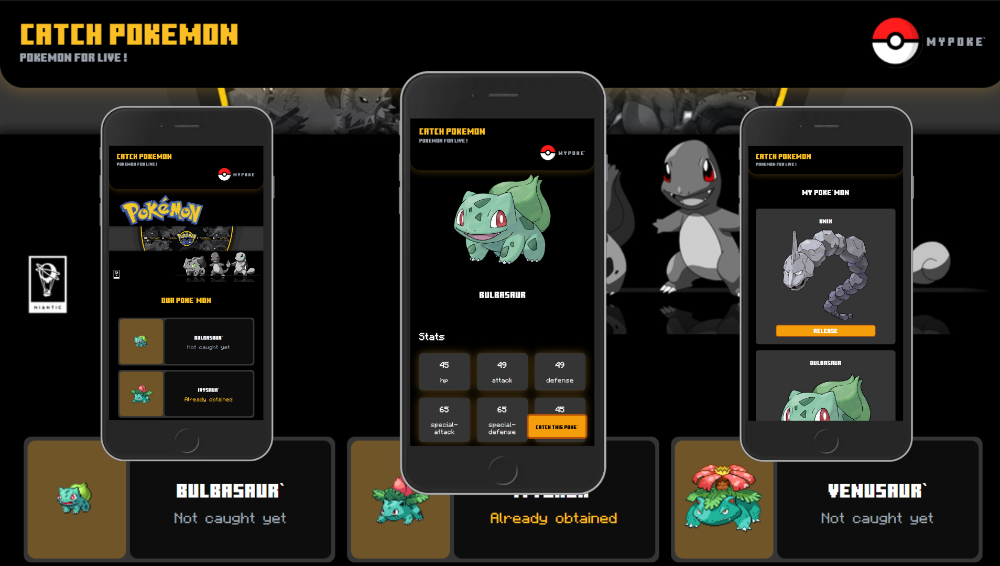

<h1 align="center">Pokemon App V2 - CatchPoke-V2</h1>

    <a href="https://catchpoke-v2.netlify.app/">... View Demo ...</a>

## Built With

## Acknowledgements

1. Typescript
2. Progressive Web Apps
3. GraphQL
4. React Hooks and React Context

## How to run the app ?

1. Open app's directory in CMD or Terminal
2. Type `yarn install`
3. Type `yarn test` (optional)
4. Type `yarn start`
5. Boom ! now the app can be accessed on http://localhost:3000/

## License

© [Timotius Nugroho](https://github.com/Timotius-Nugroho)
